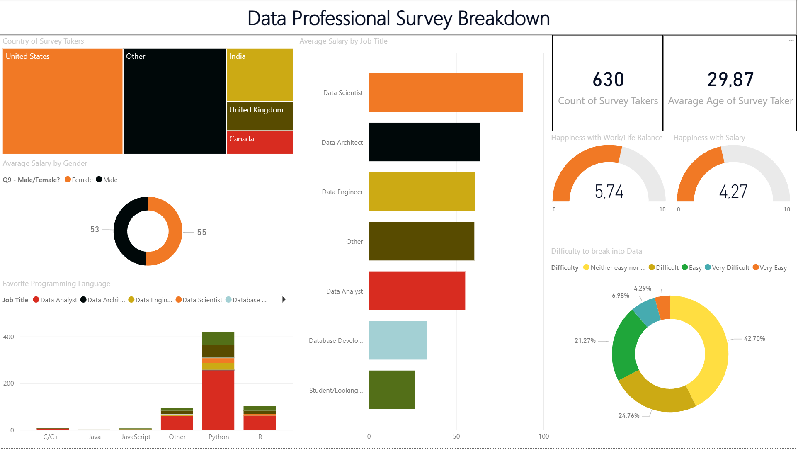

# PowerBI\_SurveyAnalysis

This project is based on a Kaggle dataset about employee surveys.  

The objective was to \*\*clean and transform the dataset in Power BI\*\* using Power Query and DAX, and then build interactive visualizations to analyze job-related insights.

## Data Cleaning \& Transformation

The raw dataset was imported into Power BI and processed with \*\*Power Query\*\*:

- Removed duplicate rows to ensure data accuracy.  

- Standardized text values using functions like `TRIM()` and `PROPER()`.  

- Transformed salary ranges (e.g., `"0-40k"`, `"80-120k"`) into numerical values:  

&nbsp; - Split the salary range into two separate columns (lower and upper bounds).  

&nbsp; - Created a calculated column with the average salary = `(Lower Bound + Upper Bound) / 2`.  

These steps ensured consistent and usable data for analysis.

## Data Analysis \& Visualizations

A variety of visual elements were created to present key insights:

- Cards → to highlight individual metrics such as job satisfaction or average salary.  

- Bar Charts → to compare data like salary differences between genders or distribution of favorite programming languages.  

- TreeMap → to analyze responses by region, with the ability to filter other visuals by selecting a specific region.

## Purpose

This project demonstrates data cleaning, transformation, and visualization in Power BI, showcasing how raw survey data can be turned into interactive dashboards with meaningful insights.  

It is also part of my portfolio, emphasizing my skills in Power Query, DAX, and Power BI reporting.

